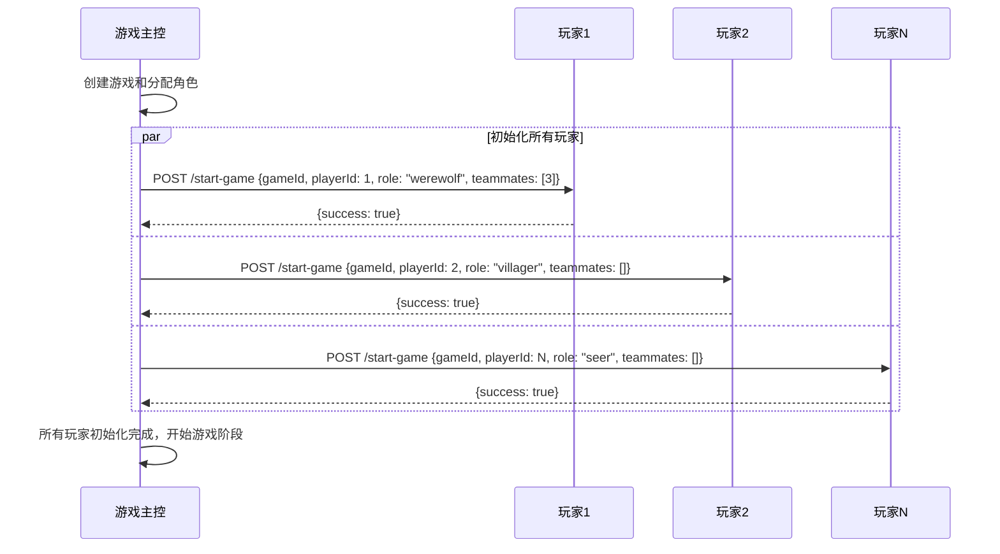
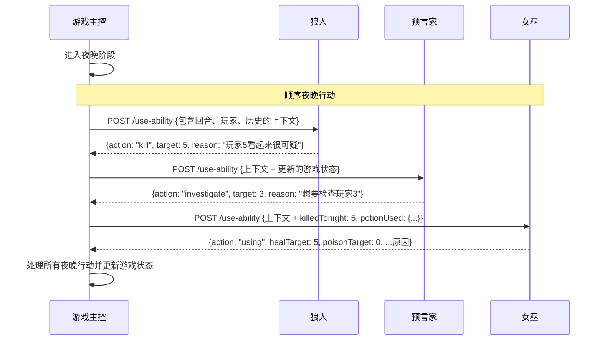
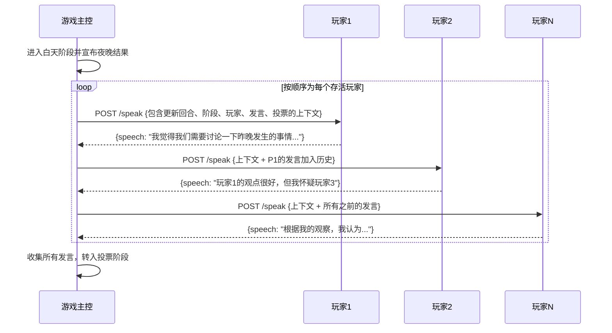
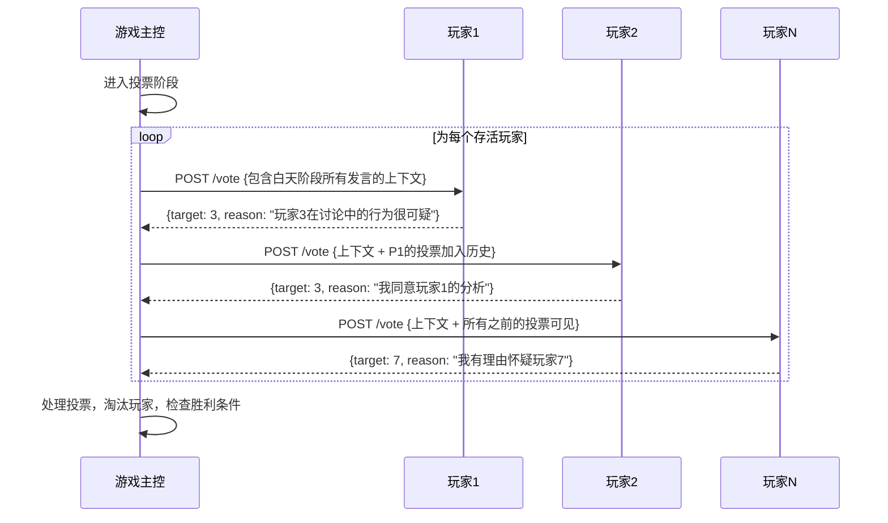

# 游戏主控-玩家通信模式

## 通信架构

AI狼人杀游戏采用**中心辐射型**通信模式，游戏主控作为中央协调器，通过HTTP API与多个分布式AI玩家服务进行通信。

```
                    游戏主控 (端口 3000)
                           │
        ┌──────────────────┼──────────────────┐
        │                  │                  │
   玩家1             玩家2            玩家N
  (端口3001)        (端口3002)       (端口300N)
```

## 通信原则

### 1. 基于HTTP的同步通信
- **协议**: HTTP/1.1 with JSON payload
- **方向**: 单向通信 (主控 → 玩家)
- **模式**: 请求-响应结构化数据传输
- **无WebSocket**: 无状态通信以保持简单性

### 2. 顺序处理模型
- **无并发操作**: 玩家按顺序逐个执行动作
- **游戏主控控制**: 集中编排所有游戏阶段
- **确定性顺序**: 可预测的玩家行动序列

### 3. 上下文丰富的通信
- **完整状态传输**: 每个请求包含完整的游戏上下文
- **无状态玩家**: 玩家不维护持久化游戏状态
- **历史数据**: 包含完整的发言和投票历史

## 详细通信流程

### 游戏初始化流程



### 夜晚阶段通信流程



### 白天阶段通信流程



### 投票阶段通信流程



## 数据流模式

### 请求上下文构建

游戏主控为每个请求构建丰富的上下文对象：

```typescript
// GameMaster中的上下文构建过程
function buildPlayerContext(round: number, phase: GamePhase): PlayerContext {
  return {
    round: this.currentRound,
    currentPhase: this.gamePhase,
    alivePlayers: this.getAlivePlayers(),
    allSpeeches: this.speechHistory,
    allVotes: this.voteHistory,
    // 为特殊角色添加额外的角色特定上下文
    ...(this.buildRoleSpecificContext())
  };
}
```

### 响应处理

每个玩家响应都经过验证并集成到游戏状态中：

```typescript
// GameMaster中的响应处理
async function processPlayerSpeech(playerId: number, context: PlayerContext) {
  const response = await this.playerAPIClient.getSpeech(playerId, context);
  
  // 使用Zod schema验证响应
  const validatedResponse = SpeechResponseSchema.parse(response);
  
  // 添加到游戏状态
  this.addSpeechToHistory(playerId, validatedResponse.speech);
  
  // 更新UI
  this.notifyUI('speechAdded', { playerId, speech: validatedResponse.speech });
}
```

## 通信可靠性模式

### 1. 指数退避重试逻辑

```typescript
// 在PlayerAPIClient中实现
async function callPlayerWithRetry(
  playerId: number,
  endpoint: string,
  data: any,
  maxRetries: number = 3
) {
  for (let attempt = 1; attempt <= maxRetries; attempt++) {
    try {
      return await this.httpClient.post(`/player/${playerId}${endpoint}`, data);
    } catch (error) {
      if (attempt === maxRetries) throw error;
      
      const backoffMs = Math.pow(2, attempt) * 1000; // 指数退避
      await this.delay(backoffMs);
    }
  }
}
```

### 2. 超时处理

```typescript
// 请求超时配置
const REQUEST_TIMEOUT = 30000; // 30秒

async function makePlayerRequest(playerId: number, data: any) {
  const controller = new AbortController();
  const timeoutId = setTimeout(() => controller.abort(), REQUEST_TIMEOUT);
  
  try {
    const response = await fetch(`/api/player/action`, {
      method: 'POST',
      body: JSON.stringify(data),
      signal: controller.signal
    });
    return await response.json();
  } finally {
    clearTimeout(timeoutId);
  }
}
```

### 3. 优雅降级

```typescript
// AI失败时的后备响应
async function getSpeechWithFallback(playerId: number, context: PlayerContext) {
  try {
    return await this.playerAPIClient.getSpeech(playerId, context);
  } catch (error) {
    console.error(`Player ${playerId} speech generation failed:`, error);
    return { speech: "我需要更多时间思考。" }; // 后备响应
  }
}
```

## 通信状态管理

### 游戏主控状态更新

游戏主控维护权威状态并推送更新到UI：

```typescript
// GameMaster中的状态更新模式
class GameMaster {
  private async processPlayerAction(action: PlayerAction) {
    // 1. 发送请求到玩家
    const response = await this.playerAPIClient.callPlayer(action);
    
    // 2. 验证响应
    const validatedResponse = this.validateResponse(response);
    
    // 3. 更新游戏状态
    this.updateGameState(validatedResponse);
    
    // 4. 通知UI观察者 (MobX自动更新UI)
    // MobX observables自动触发UI重新渲染
    
    // 5. 检查阶段/游戏结束条件
    this.checkTransitionConditions();
  }
}
```

### 玩家状态隔离

每个玩家服务维护最小的本地状态：

```typescript
// 玩家服务状态管理
class PlayerServer {
  private gameId?: string;
  private playerId?: number;
  private role?: Role;
  private teammates?: PlayerId[];
  
  // 无持久游戏状态 - 在每个请求中接收完整上下文
  async handleRequest(context: PlayerContext) {
    // 仅使用当前上下文处理请求
    return await this.generateResponse(context);
  }
}
```

## 性能特征

### 当前性能概况

- **顺序处理**: 每个玩家动作约1-5秒 (AI生成时间)
- **网络开销**: 最小 (本地HTTP调用)
- **上下文大小**: 随游戏历史增长 (发言/投票累积)
- **内存使用**: 随游戏长度线性增长

### 瓶颈分析

1. **AI生成时间**: 主要瓶颈 (每次调用1-5秒)
2. **顺序处理**: 玩家动作无并行化
3. **上下文传输**: 后期游戏轮次的大型上下文对象
4. **单游戏限制**: 前端一次只处理一个游戏

### 优化机会

1. **并行夜晚动作**: 某些夜晚动作可以并发执行
2. **上下文修剪**: 将历史数据限制为最近轮次
3. **响应缓存**: 缓存相似上下文以实现更快响应
4. **连接池**: 重用HTTP连接以获得更好性能

## 错误处理模式

### 网络级错误

```typescript
// 网络错误分类和处理
function handleNetworkError(error: any, playerId: number) {
  if (error.code === 'ECONNREFUSED') {
    // 玩家服务下线
    this.markPlayerOffline(playerId);
    return this.getDefaultResponse();
  } else if (error.code === 'TIMEOUT') {
    // 请求超时
    this.logTimeout(playerId);
    throw new GameError(`Player ${playerId} timed out`);
  } else {
    // 通用网络错误
    throw new GameError(`Network error for player ${playerId}: ${error.message}`);
  }
}
```

### AI生成错误

```typescript
// AI特定错误处理
function handleAIError(error: any, functionId: string) {
  if (error.message.includes('content_filter')) {
    // 内容过滤器触发
    return this.getCleanFallbackResponse();
  } else if (error.message.includes('rate_limit')) {
    // 速率限制超出
    await this.backoffAndRetry();
  } else if (error.message.includes('validation')) {
    // Zod验证失败
    this.logValidationError(error, functionId);
    return this.getValidFallbackResponse();
  }
}
```

该通信架构确保了集中式游戏主控和分布式AI玩家之间可靠、可观察和可维护的交互，同时保持清晰的关注点分离和强大的错误处理。