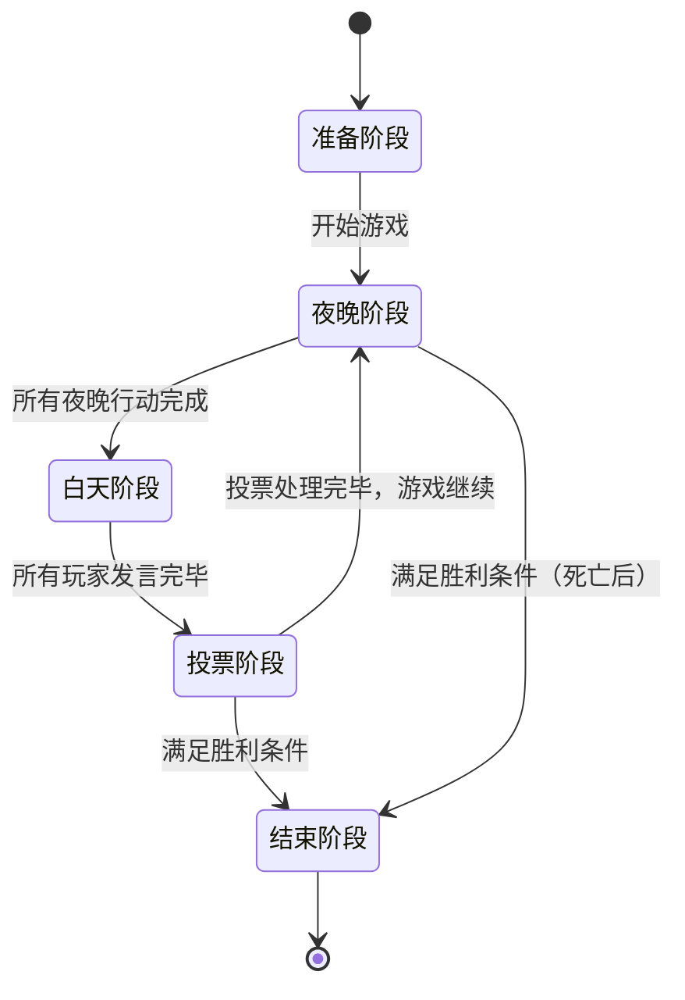

# 游戏流程与状态管理

## 游戏流程架构

AI 狼人游戏实现了一个**有限状态机 (FSM)** 模式，具有明确定义的阶段、转换和胜利条件。游戏主控作为中央状态协调器，而 AI 玩家响应状态查询，不维护持久状态。

## 游戏状态与转换

### 状态图



### 状态定义

```typescript
enum GamePhase {
  PREPARING = 'preparing',  // 游戏设置和玩家分配
  NIGHT = 'night',         // 角色能力（狼人杀人、预言家调查等）
  DAY = 'day',             // 讨论阶段（玩家按顺序发言）
  VOTING = 'voting',       // 投票阶段（淘汰可疑玩家）
  ENDED = 'ended'          // 游戏结束（满足胜利条件）
}

enum WinCondition {
  ONGOING = 'ongoing',              // 游戏继续
  WEREWOLVES_WIN = 'werewolves_win', // 狼人 ≥ 其他玩家
  VILLAGERS_WIN = 'villagers_win'    // 所有狼人被淘汰
}
```

## 详细阶段机制

### 1. 准备阶段 (PREPARING)

**目的**: 游戏初始化和玩家设置

**状态操作**:
- 创建具有唯一ID的游戏实例
- 生成6-8个AI玩家实例
- 使用平衡分配算法分配角色
- 通过 HTTP API 初始化玩家服务
- 设置游戏上下文和历史跟踪

**转换条件**:
- 所有玩家成功初始化
- 角色分配完成并确认
- 玩家服务响应健康检查

```typescript
// 游戏创建和设置
async createGame(playerCount: number = 6) {
  this.gameId = generateUniqueId();
  this.gamePhase = GamePhase.PREPARING;
  
  // 生成平衡的角色分配
  this.roles = generateRoleAssignment(playerCount);
  
  // 初始化所有AI玩家
  await Promise.all(
    this.roles.map((role, index) => 
      this.initializePlayer(index + 1, role)
    )
  );
  
  this.gamePhase = GamePhase.NIGHT;
  this.currentRound = 1;
}
```

### 2. 夜晚阶段 (NIGHT)

**目的**: 执行角色特定能力

**顺序操作**:
1. **狼人行动**: 选择要消灭的目标
2. **预言家行动**: 调查玩家阵营（好人/坏人）
3. **女巫行动**: 使用治疗和/或毒药药水

**状态更新**:
- 处理狼人击杀
- 记录预言家调查结果
- 应用女巫药水（治疗拯救被杀玩家，毒药增加死亡）
- 更新玩家存活状态
- 检查即时胜利条件

**转换逻辑**:
```typescript
async processNightPhase() {
  // 1. 狼人杀人
  const werewolfAction = await this.getWerewolfAction();
  let killedPlayer = werewolfAction.target;
  
  // 2. 预言家调查
  const seerAction = await this.getSeerAction();
  this.addSeerResult(seerAction.target, this.isPlayerGood(seerAction.target));
  
  // 3. 女巫使用药水
  const witchAction = await this.getWitchAction(killedPlayer);
  if (witchAction.healTarget === killedPlayer) {
    killedPlayer = null; // 玩家被救
  }
  if (witchAction.poisonTarget > 0) {
    this.addPoisonTarget(witchAction.poisonTarget);
  }
  
  // 4. 处理死亡并检查胜利条件
  this.processDeaths();
  if (this.checkWinCondition() !== WinCondition.ONGOING) {
    this.gamePhase = GamePhase.ENDED;
  } else {
    this.gamePhase = GamePhase.DAY;
  }
}
```

### 3. 白天阶段 (DAY)

**目的**: 讨论和信息分享

**顺序流程**:
- 宣布夜晚阶段结果（死亡情况，如果有的话）
- 每个存活玩家按预定顺序发言
- 玩家可以分享信息、指控或转移嫌疑
- AI 玩家分析历史上下文并生成情境化发言

**发言生成上下文**:
```typescript
interface DayPhaseContext {
  nightResults: {
    deaths: PlayerId[];
    newInformation?: string; // 关于死亡的公告
  };
  previousSpeeches: Speech[];
  playerStates: PlayerInfo[];
  roundHistory: HistoricalData;
}
```

**转换条件**:
- 所有存活玩家都恰好发言一次
- 发言记录在永久历史中
- 没有检测到即时游戏结束条件

### 4. 投票阶段 (VOTING)

**目的**: 民主消除可疑玩家

**投票流程**:
1. 所有存活玩家为消除目标投票
2. 玩家为他们的投票提供理由
3. 票数统计，采用多数决规则
4. 平票处理机制（在平票玩家中随机选择）
5. 消除和遗言

**投票处理算法**:
```typescript
async processVotingPhase() {
  const votes: Vote[] = [];
  
  // 收集所有投票
  for (const playerId of this.getAlivePlayers()) {
    const vote = await this.getPlayerVote(playerId);
    votes.push({ voterId: playerId, targetId: vote.target });
  }
  
  // 统计投票并处理平票
  const voteCount = this.tallyVotes(votes);
  const eliminatedPlayer = this.resolveVoteOutcome(voteCount);
  
  // 处理淘汰
  this.eliminatePlayer(eliminatedPlayer);
  
  // 检查胜利条件
  const winCondition = this.checkWinCondition();
  if (winCondition !== WinCondition.ONGOING) {
    this.gamePhase = GamePhase.ENDED;
  } else {
    this.currentRound++;
    this.gamePhase = GamePhase.NIGHT;
  }
}
```

### 5. 结束阶段 (ENDED)

**目的**: 游戏结束和结果公布

**最终状态处理**:
- 确定并宣布获胜者
- 揭示所有玩家角色
- 生成游戏总结和统计数据
- 清理资源和玩家连接

## 状态管理架构

### 中心化状态模型

游戏主控维护所有游戏状态的**单一可信数据源**:

```typescript
class GameMaster {
  // 核心游戏状态
  private gameId: string;
  private gamePhase: GamePhase;
  private currentRound: number;
  private players: Map<PlayerId, PlayerState>;
  
  // 历史数据
  private speechHistory: AllSpeeches;
  private voteHistory: AllVotes;
  private nightActionHistory: NightActionHistory;
  
  // 角色特定状态
  private seerInvestigations: Map<Round, Investigation>;
  private witchPotionUsage: PotionUsage;
  private werewolfActions: Map<Round, WerewolfAction>;
}
```

### MobX 响应式状态

前端使用 MobX 进行响应式状态管理，实现自动UI更新:

```typescript
// 可观察游戏状态
class GameStore {
  @observable gamePhase: GamePhase = GamePhase.PREPARING;
  @observable currentRound: number = 0;
  @observable players: ObservableMap<PlayerId, PlayerState>;
  @observable speeches: AllSpeeches = {};
  @observable votes: AllVotes = {};
  
  // 计算值
  @computed get alivePlayers(): PlayerInfo[] {
    return Array.from(this.players.values()).filter(p => p.isAlive);
  }
  
  @computed get currentPhaseProgress(): number {
    // 计算阶段完成百分比
    switch (this.gamePhase) {
      case GamePhase.DAY:
        return this.speechesThisRound.length / this.alivePlayers.length;
      case GamePhase.VOTING:
        return this.votesThisRound.length / this.alivePlayers.length;
      default:
        return 0;
    }
  }
}
```

### 玩家状态隔离

从游戏角度来看，AI 玩家是**无状态**的——它们在每个请求中接收完整上下文:

```typescript
// 玩家服务 - 无持久游戏状态
class PlayerServer {
  // 仅配置状态
  private config: PlayerConfig;
  private role?: Role;
  
  // 所有游戏上下文来自请求
  async handleGameAction(context: PlayerContext) {
    // 仅使用提供的上下文处理
    // 不维护内部游戏状态
    return this.generateResponse(context);
  }
}
```

## 状态持久化与恢复

### 当前实现（内存中）

- **游戏状态**: 存储在 GameMaster 实例中（仅内存）
- **会话持久化**: 浏览器刷新后丢失
- **玩家状态**: 配置持久化在文件中，游戏状态短暂

### 未来持久化策略

```typescript
interface GameStateSnapshot {
  gameId: string;
  phase: GamePhase;
  round: number;
  players: PlayerState[];
  history: {
    speeches: AllSpeeches;
    votes: AllVotes;
    nightActions: NightActionHistory;
  };
  timestamp: Date;
}

// 提议的持久化层
class GameStatePersistence {
  async saveGameState(snapshot: GameStateSnapshot) {
    // 保存到数据库/文件系统
  }
  
  async loadGameState(gameId: string): Promise<GameStateSnapshot> {
    // 从持久存储加载
  }
  
  async resumeGame(gameId: string) {
    // 恢复游戏主控和玩家状态
  }
}
```

## 胜利条件逻辑

### 胜利条件评估

```typescript
function checkWinCondition(): WinCondition {
  const alivePlayers = this.getAlivePlayers();
  const aliveWerewolves = alivePlayers.filter(p => p.role === Role.WEREWOLF);
  const aliveVillagers = alivePlayers.filter(p => p.role !== Role.WEREWOLF);
  
  // 狼人数量大于等于其他玩家时狼人胜利
  if (aliveWerewolves.length >= aliveVillagers.length) {
    return WinCondition.WEREWOLVES_WIN;
  }
  
  // 所有狼人被淘汰时村民胜利
  if (aliveWerewolves.length === 0) {
    return WinCondition.VILLAGERS_WIN;
  }
  
  // 游戏继续
  return WinCondition.ONGOING;
}
```

### 胜利条件时机

在特定状态转换点检查胜利条件：

1. **夜晚阶段后**: 转移到白天阶段前
2. **投票消除后**: 开始下一轮前
3. **玩家死亡后**: 立即检查游戏结束

## 错误恢复与状态一致性

### 状态验证

```typescript
function validateGameState(): StateValidationResult {
  const errors: string[] = [];
  
  // 验证玩家数量
  if (this.getAlivePlayers().length < 2) {
    errors.push('Too few players alive');
  }
  
  // 验证角色分配
  const roles = this.getPlayerRoles();
  if (roles.werewolf === 0 || roles.villager === 0) {
    errors.push('Invalid role distribution');
  }
  
  // 验证阶段一致性
  if (!this.isValidPhaseTransition(this.previousPhase, this.gamePhase)) {
    errors.push('Invalid phase transition');
  }
  
  return { valid: errors.length === 0, errors };
}
```

### 恢复策略

1. **网络故障**: 采用指数退避重试
2. **AI 故障**: 后备响应以维持游戏流程
3. **状态损坏**: 状态验证和回滚机制
4. **玩家断连**: 默认操作防止游戏阻塞

## 性能考虑

### 状态大小管理

- **历史数据**: 随游戏长度线性增长
- **上下文传输**: 后期回合负载较大
- **内存使用**: 受最大游戏长度限制

### 优化策略

1. **上下文修剪**: 将历史上下文限制在最近几轮
2. **懒加载**: 按需加载历史数据
3. **压缩**: 压缩大型上下文对象
4. **缓存**: 缓存计算值和AI响应

这种状态管理架构确保了可预测的游戏流程、清晰的状态所有权和可靠的状态转换，同时保持了AI驱动多人游戏所需的灵活性。