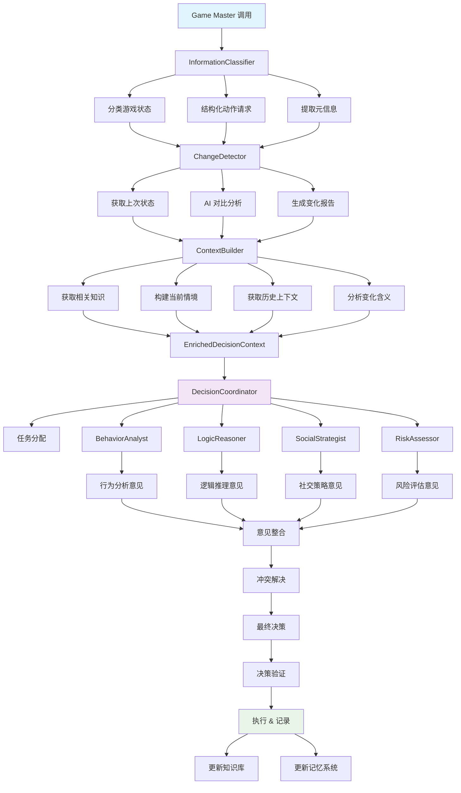

# Fastify Agent 新架构设计方案

## 概述

本文档描述了 AI-Werewolf 游戏中新一代 Player Agent 的架构设计。相比现有的简单 Prompt 系统，新架构引入了 Context 概念、内存知识库和多 Agent 决策系统，旨在打造更智能、更灵活的 AI 玩家。

## 🔍 现有架构问题分析

### 当前 Player 包的限制

1. **无状态设计**：每次 AI 调用都是独立的，缺乏历史记忆和上下文连续性
2. **单一 AI 决策**：所有决策都通过一个 AI 模型，没有专业化分工
3. **僵化的 Prompt 系统**：基于静态模板，难以动态适应复杂情况
4. **缺乏知识积累**：无法从游戏历史中学习和改进策略
5. **决策透明度低**：无法追踪推理过程和决策依据

## 🏗️ 新架构设计方案

### 1. Context 概念与内存知识库系统

```typescript
// 核心 Context 层次结构
interface GameContext {
  // 持久化游戏状态
  gameMemory: GameMemory;
  // 当前回合上下文  
  roundContext: RoundContext;
  // 玩家认知状态
  cognition: PlayerCognition;
  // 知识库
  knowledgeBase: KnowledgeBase;
}

interface GameMemory {
  // 历史行为记录
  behaviorHistory: Map<PlayerId, PlayerBehavior[]>;
  // 投票模式分析
  votingPatterns: VotingPattern[];
  // 发言风格分析
  speechAnalysis: Map<PlayerId, SpeechProfile>;
  // 可疑度评估历史
  suspicionHistory: Map<PlayerId, SuspicionScore[]>;
}

interface PlayerCognition {
  // 对其他玩家的认知
  playerModels: Map<PlayerId, PlayerModel>;
  // 当前假设
  hypotheses: GameHypothesis[];
  // 信任网络
  trustNetwork: TrustGraph;
  // 推理链
  reasoningChains: ReasoningChain[];
}

interface KnowledgeBase {
  // 通用知识库
  generalKnowledge: GeneralGameKnowledge;
  // 策略知识
  strategies: StrategyKnowledge;
  // 历史经验
  experienceBase: ExperienceDatabase;
  // 模式库
  patterns: PatternLibrary;
}
```

### 2. 多 Agent 决策系统架构

```typescript
// Agent 专业化分工体系
interface AgentSystem {
  // 核心决策代理
  decisionCoordinator: DecisionCoordinator;
  // 专业化代理
  specialists: {
    // 行为分析师：分析其他玩家行为模式
    behaviorAnalyst: BehaviorAnalyst;
    // 逻辑推理师：进行逻辑推导和假设验证
    logicReasoner: LogicReasoner;
    // 社交策略师：处理发言和社交互动
    socialStrategist: SocialStrategist;
    // 风险评估师：评估决策风险
    riskAssessor: RiskAssessor;
    // 信息管理师：管理和整理信息
    informationManager: InformationManager;
  };
}

// 决策协调器 - 核心大脑
class DecisionCoordinator {
  async makeDecision(
    context: GameContext,
    decisionType: 'speech' | 'vote' | 'ability',
    specialists: AgentSpecialists
  ): Promise<Decision> {
    // 1. 收集专家意见
    const expertOpinions = await this.consultExperts(context, decisionType, specialists);
    
    // 2. 权衡不同意见
    const weighedOptions = await this.weighOptions(expertOpinions, context);
    
    // 3. 最终决策
    const finalDecision = await this.makeCompromisedDecision(weighedOptions);
    
    // 4. 记录决策推理过程
    await this.recordDecisionReasoning(finalDecision, expertOpinions);
    
    return finalDecision;
  }
}

// 专业化代理基类
abstract class SpecialistAgent {
  abstract specialty: string;
  protected context: GameContext;
  protected aiService: AIService;
  
  abstract async analyze(context: GameContext): Promise<SpecialistOpinion>;
  abstract async recommend(situation: GameSituation): Promise<Recommendation>;
}
```

### 3. 专业化代理详细设计

#### 行为分析师 (BehaviorAnalyst)
- **职责**：分析其他玩家的行为模式、发言风格、投票倾向
- **输出**：玩家行为档案、异常行为检测、身份推断概率

#### 逻辑推理师 (LogicReasoner)
- **职责**：进行逻辑推导、假设验证、矛盾检测
- **输出**：逻辑推理链、假设验证结果、矛盾点分析

#### 社交策略师 (SocialStrategist)
- **职责**：制定发言策略、管理人际关系、控制信息披露
- **输出**：发言内容建议、社交策略、联盟建议

#### 风险评估师 (RiskAssessor)
- **职责**：评估决策风险、预测后果、制定风险缓解策略
- **输出**：风险评估报告、后果预测、缓解建议

#### 信息管理师 (InformationManager)
- **职责**：整理游戏信息、维护知识库、提供决策支持数据
- **输出**：信息摘要、知识检索、数据分析报告

## 🗂️ 目录结构设计

```
fastify-agent/
├── src/
│   ├── core/                    # 核心系统
│   │   ├── GameContext.ts       # 游戏上下文管理
│   │   ├── MemorySystem.ts      # 内存与知识库
│   │   └── AgentOrchestrator.ts # 代理协调器
│   │
│   ├── processing/              # 信息处理管道
│   │   ├── InformationClassifier.ts  # 信息分类器
│   │   ├── ChangeDetector.ts         # 变化检测器
│   │   └── ContextBuilder.ts         # 上下文构建器
│   │
│   ├── agents/                  # 多代理系统
│   │   ├── DecisionCoordinator.ts    # 决策协调器
│   │   ├── specialists/              # 专业化代理
│   │   │   ├── BehaviorAnalyst.ts    # 行为分析师
│   │   │   ├── LogicReasoner.ts      # 逻辑推理师
│   │   │   ├── SocialStrategist.ts   # 社交策略师
│   │   │   ├── RiskAssessor.ts       # 风险评估师
│   │   │   └── InformationManager.ts # 信息管理师
│   │   └── base/
│   │       └── SpecialistAgent.ts    # 代理基类
│   │
│   ├── knowledge/               # 知识管理系统
│   │   ├── PlayerModelDB.ts     # 玩家模型数据库
│   │   ├── PatternRecognition.ts # 模式识别
│   │   ├── HypothesisEngine.ts   # 假设推理引擎
│   │   ├── RoleKnowledgeBase.ts  # 角色特定知识库
│   │   └── RoleStrategies.ts     # 预制角色策略
│   │
│   ├── reasoning/               # 推理系统
│   │   ├── LogicalReasoning.ts  # 逻辑推理
│   │   ├── ProbabilisticReasoning.ts # 概率推理
│   │   └── StrategicReasoning.ts # 策略推理
│   │
│   └── interfaces/              # 接口定义
│       ├── GameTypes.ts         # 游戏类型定义
│       ├── AgentTypes.ts        # 代理类型定义
│       ├── ProcessingTypes.ts   # 处理流程类型定义
│       ├── RoleTypes.ts         # 角色相关类型定义
│       └── MemoryTypes.ts       # 记忆类型定义
```

## 🔄 信息处理与决策流程设计

### 信息处理管道架构



### 核心处理组件设计

#### 1. 信息分类器 (InformationClassifier)
```typescript
// Game Master 输入的原始数据
interface GameMasterInput {
  gameId: string;
  playerId: number;
  timestamp: number;
  actionType: 'speech' | 'vote' | 'ability' | 'phase_change' | 'game_event';
  
  // 完整游戏状态
  gameState: {
    currentPhase: GamePhase;
    round: number;
    alivePlayers: PlayerId[];
    deadPlayers: { playerId: PlayerId; deathReason: string; round: number }[];
    dayDiscussion?: SpeechRecord[];
    votingResults?: VotingRecord[];
    nightResults?: NightActionResult[];
  };
  
  // 请求的具体行动
  requestedAction?: {
    type: 'speak' | 'vote' | 'use_ability';
    constraints?: any; // 比如投票候选人列表，能力使用限制等
  };
}

class InformationClassifier {
  async classifyAndStructure(input: GameMasterInput): Promise<ClassifiedInformation> {
    return {
      metadata: {
        gameId: input.gameId,
        playerId: input.playerId,
        timestamp: input.timestamp,
        actionType: input.actionType,
      },
      gameInformation: {
        currentState: await this.structureCurrentState(input.gameState),
        actionRequest: await this.structureActionRequest(input.requestedAction),
      },
      changeDetectionInput: input.gameState,
    };
  }
}
```

#### 2. 变化检测器 (ChangeDetector)
```typescript
class ChangeDetector {
  private lastGameState: Map<string, GameState> = new Map();
  
  async detectChanges(gameId: string, currentState: GameState): Promise<GameChanges> {
    const lastState = this.lastGameState.get(gameId);
    
    if (!lastState) {
      return this.createInitialChanges(currentState);
    }
    
    // AI 驱动的变化检测
    const changes = await this.aiDetectChanges(lastState, currentState);
    
    // 更新缓存
    this.lastGameState.set(gameId, currentState);
    
    return changes;
  }
  
  private async aiDetectChanges(oldState: GameState, newState: GameState): Promise<GameChanges> {
    // 使用 AI 对比两个状态，找出关键变化
    const prompt = `
对比以下两个游戏状态，找出关键变化：

上一状态: ${JSON.stringify(oldState, null, 2)}
当前状态: ${JSON.stringify(newState, null, 2)}

请识别并分类以下变化：
1. 新增发言（包括发言者、内容、情感倾向）
2. 投票变化（新增投票、投票结果）
3. 玩家状态变化（死亡、复活）
4. 阶段变化（白天->投票->夜晚）
5. 其他重要事件

返回结构化的变化信息。
    `;
    
    return await this.aiService.detectChanges(prompt, oldState, newState);
  }
}

interface GameChanges {
  // 新增的信息
  newInformation: {
    speeches: SpeechChange[];
    votes: VoteChange[];
    deaths: DeathChange[];
    phaseChanges: PhaseChange[];
    abilities: AbilityChange[];
  };
  
  // 重要的模式变化
  patternChanges: {
    suspicionShifts: SuspicionChange[];
    allianceChanges: AllianceChange[];
    behaviorAnomalies: BehaviorAnomaly[];
  };
  
  // AI 分析的要点
  aiInsights: {
    criticalEvents: string[];
    attentionPoints: string[];
    strategicImplications: string[];
  };
}
```

#### 3. 上下文构建器 (ContextBuilder)
```typescript
class ContextBuilder {
  constructor(
    private knowledgeBase: KnowledgeBase,
    private memorySystem: MemorySystem
  ) {}
  
  async buildDecisionContext(
    classifiedInfo: ClassifiedInformation,
    gameChanges: GameChanges,
    playerId: number
  ): Promise<EnrichedDecisionContext> {
    
    // 1. 获取相关知识
    const relevantKnowledge = await this.knowledgeBase.getRelevantKnowledge({
      currentPhase: classifiedInfo.gameInformation.currentState.currentPhase,
      playerRole: await this.memorySystem.getPlayerRole(playerId),
      gameChanges: gameChanges,
    });
    
    // 2. 构建当前情境
    const currentSituation = await this.buildCurrentSituation(
      classifiedInfo, 
      gameChanges, 
      relevantKnowledge
    );
    
    // 3. 获取历史上下文
    const historicalContext = await this.memorySystem.getRelevantHistory(
      classifiedInfo.gameInformation.currentState,
      gameChanges
    );
    
    // 4. 构建决策上下文
    return {
      gameState: classifiedInfo.gameInformation.currentState,
      actionRequest: classifiedInfo.gameInformation.actionRequest,
      recentChanges: gameChanges,
      changeAnalysis: await this.analyzeChangeImplications(gameChanges),
      relevantKnowledge: relevantKnowledge,
      historicalContext: historicalContext,
      currentSituation: currentSituation,
      strategicContext: await this.buildStrategicContext(currentSituation),
      constraints: await this.identifyConstraints(classifiedInfo),
    };
  }
}
```

#### 4. 升级版决策协调器 (DecisionCoordinator)
```typescript
interface CoordinatorInput {
  decisionRequest: {
    type: 'speech' | 'vote' | 'ability';
    priority: 'urgent' | 'normal' | 'low';
    deadline?: number;
  };
  context: EnrichedDecisionContext;
  agentConfiguration: {
    enabledAgents: AgentType[];
    agentWeights: Record<AgentType, number>;
    specialFocus?: string[];
  };
  requirements: {
    confidenceThreshold: number;
    maxDeliberationTime: number;
    reasoningDepth: 'shallow' | 'deep' | 'comprehensive';
  };
}

class DecisionCoordinator {
  async makeDecision(input: CoordinatorInput): Promise<CoordinatedDecision> {
    const startTime = Date.now();
    
    // 1. 预处理和任务分配
    const taskAssignments = await this.assignTasksToAgents(input);
    
    // 2. 并行咨询专家代理
    const expertOpinions = await this.consultExpertsInParallel(
      input.context, 
      taskAssignments
    );
    
    // 3. 意见整合和冲突解决
    const integratedAnalysis = await this.integrateExpertOpinions(
      expertOpinions, 
      input.agentConfiguration.agentWeights
    );
    
    // 4. 最终决策生成
    const finalDecision = await this.generateFinalDecision(
      integratedAnalysis,
      input.requirements
    );
    
    // 5. 决策验证和记录
    const validatedDecision = await this.validateAndRecord(
      finalDecision,
      input,
      Date.now() - startTime
    );
    
    return validatedDecision;
  }
}
```

## 📊 核心特性设计

### 1. 智能信息处理流程
```
Game Master 输入 → 信息分类 → 变化检测 → 上下文构建 → 多代理决策 → 执行记录
```

**核心创新点：**
- **智能变化检测**：使用 AI 对比游戏状态，自动识别关键变化和战略含义
- **分层上下文构建**：原始数据 → 结构化信息 → 变化分析 → 战略上下文
- **任务智能分配**：根据决策类型和当前情况动态分配专家任务权重

### 2. 角色特化系统

#### 角色感知的知识库架构
```typescript
// 角色特化的知识库系统
interface RoleSpecificKnowledgeBase {
  // 基础游戏知识（所有角色共享）
  coreGameKnowledge: CoreGameKnowledge;
  
  // 角色特定知识
  roleKnowledge: {
    [Role.VILLAGER]: VillagerKnowledge;
    [Role.WEREWOLF]: WerewolfKnowledge;
    [Role.SEER]: SeerKnowledge;
    [Role.WITCH]: WitchKnowledge;
  };
  
  // 角色间的互动知识
  roleInteractionKnowledge: RoleInteractionMatrix;
}

// 村民知识
interface VillagerKnowledge {
  // 推理策略
  deductionStrategies: {
    speechAnalysis: SpeechAnalysisGuides;
    votingPatternAnalysis: VotingPatternGuides;
    behaviorAnalysis: BehaviorAnalysisGuides;
    timelineAnalysis: TimelineAnalysisGuides;
  };
  
  // 生存策略
  survivalStrategies: {
    lowProfile: string[]; // 低调策略
    leadership: string[]; // 领导策略
    alliance: string[];   // 联盟策略
  };
  
  // 发言技巧
  speechTactics: {
    suspicionRaising: string[];
    informationGathering: string[];
    trustBuilding: string[];
  };
}

// 狼人知识
interface WerewolfKnowledge {
  // 伪装策略
  disguiseStrategies: {
    falseDeduction: string[];  // 假推理
    misdirection: string[];    // 误导
    framingTechniques: string[]; // 栽赃
  };
  
  // 团队协作
  teamCoordination: {
    implicitCommunication: string[]; // 隐含沟通
    sacrificeStrategies: string[];   // 牺牲策略
    protectionTactics: string[];     // 保护队友
  };
  
  // 节奏控制
  gameControlStrategies: {
    voteManipulation: string[];
    informationControl: string[];
    psychologicalPressure: string[];
  };
}
```

#### 角色适应的专家代理系统
```typescript
// 角色感知的专家代理
abstract class RoleAwareSpecialistAgent extends SpecialistAgent {
  protected playerRole: Role;
  protected roleKnowledge: any; // 角色特定知识
  
  constructor(role: Role, knowledgeBase: RoleSpecificKnowledgeBase) {
    super();
    this.playerRole = role;
    this.roleKnowledge = knowledgeBase.roleKnowledge[role];
  }
  
  // 角色特定的分析方法
  abstract async analyzeWithRoleContext(
    context: GameContext, 
    roleSpecificInfo: any
  ): Promise<RoleSpecificOpinion>;
}

// 角色特化的决策协调器
class RoleAwareDecisionCoordinator extends DecisionCoordinator {
  private playerRole: Role;
  private roleSpecificStrategies: RoleStrategyEngine;
  
  async makeRoleSpecificDecision(input: CoordinatorInput): Promise<CoordinatedDecision> {
    // 1. 角色特定的任务权重调整
    const roleAdjustedWeights = this.adjustAgentWeightsByRole(
      input.agentConfiguration.agentWeights,
      input.decisionRequest.type
    );
    
    // 2. 获取角色特定的专家意见
    const roleSpecificOpinions = await this.consultRoleSpecificExperts(input.context);
    
    // 3. 应用角色特定的决策规则
    const roleFilteredOptions = await this.applyRoleSpecificFilters(
      roleSpecificOpinions,
      input.requirements
    );
    
    // 4. 最终决策（考虑角色目标）
    return await this.generateRoleAlignedDecision(roleFilteredOptions, input);
  }
  
  private adjustAgentWeightsByRole(
    baseWeights: Record<AgentType, number>,
    decisionType: string
  ): Record<AgentType, number> {
    const adjustedWeights = { ...baseWeights };
    
    switch (this.playerRole) {
      case Role.WEREWOLF:
        // 狼人更依赖社交策略师和风险评估师
        adjustedWeights.socialStrategist *= 1.5;
        adjustedWeights.riskAssessor *= 1.3;
        adjustedWeights.logicReasoner *= 0.8; // 狼人要避免过于逻辑化
        break;
        
      case Role.SEER:
        // 预言家更依赖逻辑推理师和信息管理师
        adjustedWeights.logicReasoner *= 1.5;
        adjustedWeights.informationManager *= 1.4;
        adjustedWeights.socialStrategist *= 1.2; // 需要考虑何时公布信息
        break;
        
      case Role.WITCH:
        // 女巫需要谨慎的风险评估和策略分析
        adjustedWeights.riskAssessor *= 1.6;
        adjustedWeights.logicReasoner *= 1.3;
        break;
        
      default: // VILLAGER
        // 村民均衡发展，略微偏向行为分析
        adjustedWeights.behaviorAnalyst *= 1.2;
        adjustedWeights.logicReasoner *= 1.1;
        break;
    }
    
    return adjustedWeights;
  }
}
```

#### 预制角色策略知识库
```typescript
// 预制的角色知识库内容
const WEREWOLF_STRATEGIES = {
  earlyGame: [
    "建立无害人设，避免过早成为焦点",
    "观察并记住活跃发言的好人，作为后续目标",
    "适度参与推理，但避免过于准确的分析",
    "与队友保持距离，避免被发现关联"
  ],
  
  midGame: [
    "根据场上信息，开始误导推理方向",
    "适时支持对好人有利但实际错误的观点",
    "观察预言家候选人，准备应对策略",
    "控制投票节奏，避免好人抱团"
  ],
  
  lateGame: [
    "加强对关键好人的攻击和质疑",
    "利用好人间的矛盾，分化好人阵营",
    "必要时可以适度暴露队友来获得信任",
    "控制最后的投票决策"
  ]
};

const SEER_STRATEGIES = {
  investigationPriority: [
    "优先查验发言积极且有威胁的玩家",
    "平衡查验可疑玩家和可信玩家",
    "避免查验明显的狼人，浪费查验机会",
    "考虑查验位置偏僻的玩家"
  ],
  
  revealTiming: [
    "有明确狼人证据时考虑公布",
    "好人阵营陷入混乱时可以出来主导",
    "自己即将被票时必须公布身份",
    "团队需要可信信息源时挺身而出"
  ],
  
  informationManagement: [
    "公布查验结果时要有逻辑支撑",
    "避免一次性公布过多信息",
    "用查验结果引导好人推理方向",
    "保护其他重要好人角色"
  ]
};

// 角色特定的信息过滤器
class RoleSpecificInformationFilter {
  async filterGameInformation(
    rawInfo: GameInformation, 
    playerRole: Role,
    teammates?: PlayerId[]
  ): Promise<FilteredGameInformation> {
    
    switch (playerRole) {
      case Role.WEREWOLF:
        return this.addWerewolfPrivateInfo(rawInfo, teammates!);
      case Role.SEER:
        return this.addSeerInvestigations(rawInfo);
      case Role.WITCH:
        return this.addWitchKnowledge(rawInfo);
      default:
        return rawInfo; // 村民看到标准信息
    }
  }
  
  private async addWerewolfPrivateInfo(
    info: GameInformation, 
    teammates: PlayerId[]
  ): Promise<FilteredGameInformation> {
    return {
      ...info,
      privateInformation: {
        knownTeammates: teammates,
        nightKillTarget: info.lastNightResult?.killedPlayer,
        teammateStatus: await this.assessTeammateStatus(teammates, info)
      }
    };
  }
}
```

### 3. 知识积累与学习系统
```typescript
interface LearningSystem {
  // 从成功/失败中学习
  learnFromOutcome(decision: Decision, outcome: GameOutcome): void;
  // 更新玩家模型
  updatePlayerModel(playerId: PlayerId, newBehavior: PlayerBehavior): void;
  // 优化决策策略
  optimizeStrategy(performance: PerformanceMetrics): void;
}
```

### 4. 透明化推理链
```typescript
interface ReasoningTrace {
  decision: Decision;
  reasoning: {
    expertOpinions: SpecialistOpinion[];
    conflictResolution: ConflictResolution;
    finalJustification: string;
    confidenceLevel: number;
  };
  contextSnapshot: GameContext;
}
```

### 5. 动态策略适应
```typescript
interface AdaptiveStrategy {
  // 根据游戏状态调整策略
  adaptToGameState(gameState: GameState): void;
  // 根据对手风格调整
  adaptToOpponents(opponentProfiles: PlayerProfile[]): void;
  // 根据历史表现优化
  optimizeFromHistory(performanceHistory: PerformanceRecord[]): void;
}
```

## 🎯 核心优势

1. **智能化程度提升**：多专家协作比单一 AI 更智能
2. **适应性增强**：通过学习历史数据动态调整策略
3. **决策质量提升**：多角度分析减少决策偏差
4. **角色特化优化**：针对不同角色的专门策略和知识体系
5. **可扩展性**：易于添加新的专家代理和角色知识
6. **可解释性**：完整的推理链可追溯
7. **容错能力**：单个代理失效不影响整体决策
8. **智能信息处理**：AI 驱动的变化检测和上下文构建

## 🚀 实施路径建议

### Phase 1: 信息处理管道 (2-3 weeks)
- [ ] 实现 InformationClassifier - 信息分类和结构化
- [ ] 实现 ChangeDetector - AI 驱动的变化检测系统
- [ ] 实现 ContextBuilder - 智能上下文构建器
- [ ] 设计和实现完整的处理流程接口

### Phase 2: 基础框架与专业代理 (3-4 weeks)
- [ ] 实现 GameContext 系统和内存管理
- [ ] 构建 Agent 基础架构和接口定义
- [ ] 实现 5 个核心专家代理
- [ ] 构建多代理决策协调机制

### Phase 3: 决策协调与整合 (2-3 weeks)
- [ ] 完善 DecisionCoordinator - 任务智能分配
- [ ] 集成专家意见整合系统
- [ ] 实现冲突解决和最终决策逻辑
- [ ] 迁移现有 Player 逻辑到新架构

### Phase 4: 学习与优化 (2-3 weeks)
- [ ] 添加知识积累和学习能力
- [ ] 实现自适应策略调整
- [ ] 性能监控和优化系统
- [ ] 推理链追踪和可视化

### Phase 5: 高级特性 (2-3 weeks)
- [ ] 高级模式识别
- [ ] 复杂假设推理
- [ ] 动态策略进化
- [ ] 多游戏学习迁移

## 🛠️ 技术选择建议

- **框架**：保持 Fastify 框架（性能优秀，轻量级）
- **语言**：TypeScript 严格类型（架构复杂度高，需要类型安全）
- **遥测**：集成现有 Langfuse 遥测（监控多代理协作）
- **存储**：考虑引入向量数据库（存储语义化知识）
- **AI 模型**：支持多模型切换（不同代理可使用不同模型）

## 📈 性能指标

### 决策质量指标
- **胜率提升**：相比现有系统的胜率提升百分比
- **决策一致性**：多轮游戏中决策逻辑的一致性评分
- **推理准确性**：推理结果与实际情况的匹配度

### 系统性能指标
- **响应时间**：平均决策响应时间
- **内存使用**：Context 和知识库的内存占用
- **API 调用效率**：AI API 调用次数和成本控制

### 学习效果指标
- **知识积累速度**：单位时间内学习到的有效模式数量
- **策略适应性**：面对不同对手风格的适应速度
- **长期表现**：多局游戏的表现趋势

## 🔮 未来扩展可能性

1. **跨游戏知识迁移**：将狼人杀中学到的知识应用到其他推理游戏
2. **多模态输入**：支持语音、表情等非文本信息
3. **人机协作模式**：AI 辅助人类玩家进行决策
4. **实时学习**：游戏过程中实时调整策略
5. **集群智能**：多个 Agent 实例之间的知识共享

---

*文档版本: v1.2.0*  
*最后更新: 2025-08-19*  
*作者: Claude Code + 用户*
*更新内容: 添加完整的角色特化系统设计，包括角色感知的知识库、专家代理和决策协调机制*